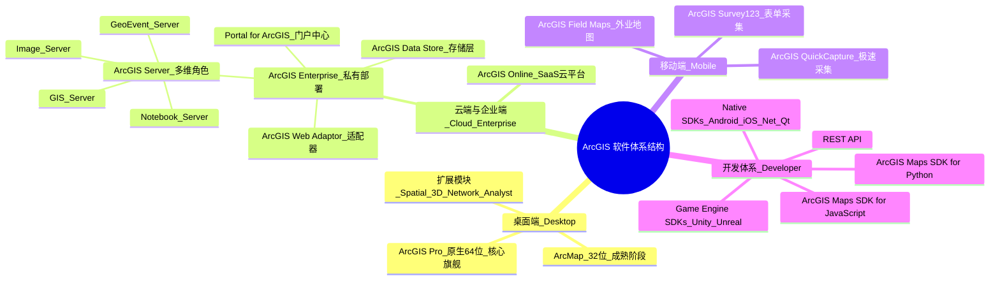

# 1.ESRI

> 美国环境系统研究所公司（Environmental Systems Research Institute, Inc. 简称ESRI公司），成立于1969年，总部位于美国加利福尼亚州雷德兰兹市，是全球最大的地理信息系统技术提供商。
> 
> [美国环境系统研究所公司_百度百科](https://baike.baidu.com/item/%E7%BE%8E%E5%9B%BD%E7%8E%AF%E5%A2%83%E7%B3%BB%E7%BB%9F%E7%A0%94%E7%A9%B6%E6%89%80%E5%85%AC%E5%8F%B8/1528104)
> 
# 2.ArcGIS简介

[https://en.wikipedia.org/wiki/ArcGIS](https://en.wikipedia.org/wiki/ArcGIS)

## (1)AecGIS历史

> ArcGIS 于 1982 年首次发布，名为 ARC/INFO ，这是一款基于命令行的 GIS 软件。
> 
> ARC/INFO 后来被合并到 ArcGIS Desktop ，并最终于 2015 年被 ArcGIS Pro 取代 。此外， ArcGIS Server 是一款服务器端 GIS 和地理数据共享软件。
> 
> 在 ArcGIS 套件发布之前，Esri 的软件开发主要集中在命令行 Arc/INFO 工作站程序和一些基于图形用户界面的产品上，例如 ArcView GIS 3.x 桌面程序。
> 
> Esri 的其他产品包括 MapObjects（一个面向开发人员的编程库） 和 ArcSDE （一个关系数据库管理系统） 。这些产品分散在多个源代码树中，彼此之间集成效果不佳。1997 年 1 月，Esri 决定改进其 GIS 软件平台，创建一个单一的集成软件架构。
> 

> 1999 年末，Esri 发布了 ArcMap 8.0，可在 Microsoft Windows 操作系统上运行。
> 
> ArcGIS 将 ArcView GIS 3.x 界面的可视化用户界面与 Arc/INFO 7.2 版工作站的部分功能相结合。
> 
> 这种结合产生了一个名为 ArcGIS 的新软件套件，其中包括命令行 ArcInfo 工作站（v8.0）和一个名为 ArcMap （v8.0）的新图形用户界面应用程序。
> 
> ArcMap 结合了 ArcInfo 的部分功能和更直观的界面 ，以及一个名为 ArcCatalog（v8.0）的文件管理应用程序 。
> 
> ArcMap 的发布是 Esri 软件产品的重大变化，将其所有客户端和服务器产品整合到使用 Microsoft Windows COM 标准开发的一个名为 ArcGIS 的软件架构下。
> 
> 虽然 ArcMap 8.0 的界面和名称与后续版本的 ArcGIS Desktop 类似，但它们是不同的产品。 ArcGIS 8.1 在产品线中取代了 ArcMap 8.0，但并不是对它的更新。

## (2)当前ArcGIS版本

# 3.ArcGIS产品结构图

---

[ArcGIS 产品体系结构 - firepation - 博客园](https://www.cnblogs.com/firepation/p/8686528.html)

[ArcGIS体系结构解析-CSDN博客](https://blog.csdn.net/sinat_32349327/article/details/78191534)

[ArcGIS | ArcGIS10 构成介绍_arcgis软件体系的构成-CSDN博客](https://blog.csdn.net/Claire_chen_jia/article/details/108410524)