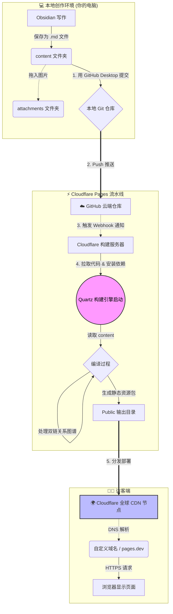

## 🤔 缘起：为什么是这个组合？

作为一名热衷于数字工具和知识管理的探索者，我一直在寻找一种理想的博客形态。我不希望它是一个孤立的“发布平台”（如 WordPress 或公众号），而希望它是我日常思考和笔记的自然延伸。

我的需求很明确：

1.  **数据掌握在自己手里**：所有内容必须是本地的纯文本文件（Markdown）。
2.  **写作体验第一**：必须能用我最熟悉的 Obsidian 进行创作，支持双向链接。
3.  **自动化**：写完文章，点一下按钮就能发布，不需要复杂的服务器维护。
4.  **低成本甚至免费**：不需要为昂贵的服务器和数据库买单。

最终，我选定了目前的这套技术栈：==**Obsidian + [[Quartz]] + GitHub + Cloudflare Pages**==。

> [!info] 
> Docs as Code
> 这是一套典型的 “Docs as Code”（像管理代码一样管理文档）的现代工作流。

---

## 🏗️ 核心组件介绍

这个博客并非一个单一的软件，而是四个强大工具的有机结合。

> [!info] 技术栈一览
> - **✍️ 创作端 (本地)：[Obsidian](https://obsidian.md/)**
>   我的第二大脑和写作台。所有的内容都在本地以 Markdown 文件形式存储。
> - **⚙️ 构建引擎 (核心)：[Quartz 4.0](https://quartz.jzhao.xyz/)**
>   一个基于 Node.js 的静态网站生成器。它的神奇之处在于能完美理解 Obsidian 的语法（如双链 `[[]]`、Callout 提示块），并把它们翻译成漂亮的网页。
> - **📦 版本控制与存储 (中转站)：[GitHub](https://github.com/)**
>   用于托管网站的源代码和内容文件，并记录每一次修改历史。
> - **☁️ 构建与分发 (云端)：[Cloudflare Pages](https://pages.cloudflare.com/)**
>   一个强大的 Serverless 平台。它负责监听 GitHub 的变动，自动运行 Quartz 进行构建，并将生成的静态网站分发到全球 CDN 节点。

---

## 🗺️ 技术路线图 (The Blueprint)

一图胜千言。下面这张流程图展示了一篇文章从我在键盘上敲下它，到最终呈现在你屏幕上的全过程。

*(注：此图由 Mermaid 实时渲染)*

---
## 📚参考资料

1. https://blog.rouper.site/posts/%E4%B8%AA%E4%BA%BA%E5%8D%9A%E5%AE%A2%E6%90%AD%E5%BB%BA-hugo--obsidian--github/
2. https://renyili.org/post/obsidian%E5%A6%82%E4%BD%95%E8%87%AA%E5%8A%A8%E5%8F%91%E5%B8%83hugo%E5%8D%9A%E5%AE%A2/
3. https://lillianwho.com/posts/Obsidian-Hugo-cloudflare/
4. https://flynx.dev/post/obsidian-hugo-github-vercel-private-blog/
5. https://sagi-rastar.github.io/2023/11/10/%E5%85%B3%E4%BA%8E%E6%88%91%E4%BD%BF%E7%94%A8obsidian%E5%8A%A0hexo%E9%83%A8%E7%BD%B2%E4%B8%AA%E4%BA%BA%E5%8D%9A%E5%AE%A2%E7%9A%84%E8%BF%87%E7%A8%8B/
6. https://sspai.com/post/54608#!
7. https://cloud.tencent.com/developer/article/1504684
8. https://geek-docs.com/html/html-ask-answer/365_html_github_pages_site_not_detecting_indexhtml.html
9. https://blog.csdn.net/qq_20042935/article/details/133920722
10. https://www.cnblogs.com/wuyepeng/p/9742690.html
11. https://cloud.tencent.com/developer/article/1967838
12. https://www.jianshu.com/p/ccc0cc8c14a0
13. https://space.bilibili.com/316183842spm_id_from=333.337.0.0
14. https://zytomorrow.top/%E6%8A%80%E6%9C%AF/%E5%8D%9A%E5%AE%A2%E5%BB%BA%E7%AB%99/%E5%88%A9%E7%94%A8obsidian%E6%9E%84%E5%BB%BA%E4%B8%AA%E4%BA%BA%E5%8D%9A%E5%AE%A2/
15. https://www.cnblogs.com/oyouoo/p/18226832
16. https://quartz.jzhao.xyz/

